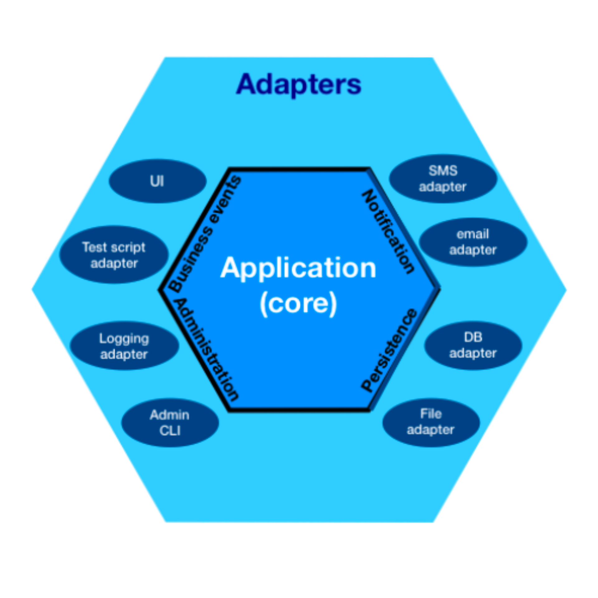

[](https://github.com/sandeshbodake/CCD/actions/workflows/main.yml)

Ruby <> DDD
---

### About CCD architecture

CCD (Core/Connector/Delivery)

Inside core all business logic related to your domain,
Inside Connector infrastructure code like creating database connection, making s3 connection, SES connection etc,
And the delivery is nothing but API handler/Event Handler, delivery layer only deals with input/output operation

CCD is nothing but a [Hexagonal architecture](https://en.wikipedia.org/wiki/Hexagonal_architecture_(software)), basically aims to creating loosely coupled application components that can be easily connected to their software environment by means of ports and adapters

See below image for reference,



---

## Local development setup

Clone this repo by running `git clone git@github.com:sandeshbodake/CCD.git`

Install bundler & install gems

```bash
gem install bundler

bundle install
```
Install ruby using rvm link [here](https://rvm.io/)

Make sure you have added `.env` file to root of the project, see example file [here](https://github.com/sandeshbodake/CCD/blob/main/.env.example)

Start dev server

```bash
rake rundev
```

Run rspec tests

```bash
rspec .
```
